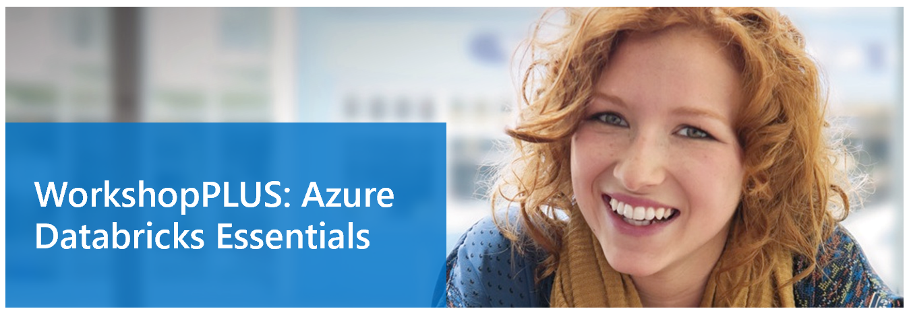

# Data Exploration with Azure Databricks

Template Version: 1.0

**Introduction**

  - This Lab uses a Airline dataset, and demonstrates:
    
      - How to create a datafram and display the data
      - How to create dataset using scala and perform filter selection
      - Create a temporary view and run a simple select queries
    

**Estimated Time**

30 minutes

**Objectives**

At the end of this lab, you will be able to:

  - Create a dataframe from csv data. You would be familiar with different spark parameters for dataframe creation.
  - Know how to create dataset using scala and perform filter operation.
  - Know how to create temporary view and run select queries.

# Table of Contents

## Lab: Data Exploration with Azure Databricks

## Tasks

1.  Familiarize with Dataset information
    
    This lab contains one Airline file, which you would use for creation of dataframe and dataset :
    
    departuredelays.csv
    
    > Note: This data file exists already as part of a Databricks installation in the dbfs file system. So no need to download it.
    

Departuredelays.csv have the following fields :

The `flights`, also known as the `departuredelays`, dataset can be found at [Airline On-Time Performance and Causes of Flight Delays: On_Time Data](https://catalog.data.gov/dataset/airline-on-time-performance-and-causes-of-flight-delays-on-time-data)

2.  Perform the lab steps
    
    Refer to M03\_L01\_Lab01.ipynb file for Databricks notebook code. Remember to import the notebook to your workspace and read the directions before executing the code

Exercise 1 has been completed